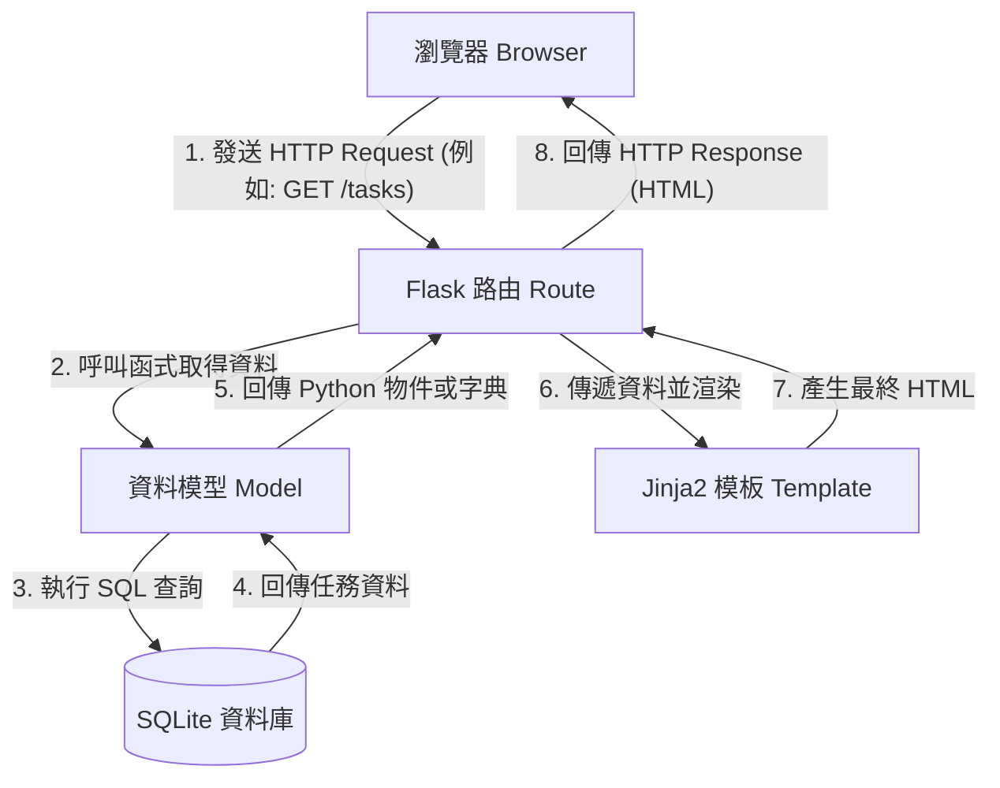

# 任務管理系統 - 系統架構文件 (Architecture)

## 1. 技術架構說明
本專案採用 Python 語言搭配 Flask 輕量級網頁框架進行開發，並結合 Jinja2 模板引擎與 SQLite 資料庫。因為專案初期不需要前後端分離，畫面會直接由 Flask 與 Jinja2 結合，並由後端渲染成 HTML 回傳給瀏覽器。

### 選用技術與原因
- **後端 (Python + Flask)**: Flask 是一個輕量級的微框架，適合快速開發中小型專案，靈活且學習曲線平緩。
- **模板引擎 (Jinja2)**: Flask 內建支援的模板引擎，讓我們在 HTML 檔案中能寫入 Python 變數與簡單邏輯（如迴圈、條件判斷），非常適合 Server-Side Rendering (SSR)。
- **資料庫 (SQLite)**: 輕量級的關聯式資料庫，以單一檔案的形式存在，不需要額外設定與架設資料庫伺服器，十分適合 MVP 階段與單機開發測試。

### Flask MVC 模式說明
雖然 Flask 本身沒有嚴格限定架構，但為了程式碼易讀與好維護，我們將採用類似 MVC（Model-View-Controller）的模式來組織目錄結構：
- **Model (資料模型)**: 負責與 SQLite 資料庫互動，處理資料的存取與邏輯（例如任務的新增、修改、刪除）。集中於 `models/` 目錄。
- **View (視圖)**: 負責呈現畫面給使用者。由 Jinja2 模板 (HTML) 與 CSS/JS 靜態資源組成。集中於 `templates/` 與 `static/` 目錄。
- **Controller (控制器)**: 負責接收使用者的 HTTP 請求 (Request)，呼叫對應的 Model 處理資料，最後將資料傳遞給 View 進行頁面渲染，並回傳 (Response) 給使用者。在 Flask 中即為各個 Route（路由），集中於 `routes/` 目錄。

## 2. 專案資料夾結構
以下是建議的專案資料夾與檔案結構，每個目錄與檔案皆有其專屬職責：

```text
web_app_development/
├── app/                        ← 應用程式主目錄
│   ├── models/                 ← 資料庫模型層 (Model)
│   │   ├── __init__.py
│   │   └── task_model.py       ← 定義「任務」的資料庫操作 (CRUD)
│   ├── routes/                 ← Flask 路由控制器 (Controller)
│   │   ├── __init__.py
│   │   └── task_routes.py      ← 處理與「任務」相關的 HTTP 請求
│   ├── templates/              ← Jinja2 HTML 模板 (View)
│   │   ├── base.html           ← 共用的網頁版型 (包含共用 Header, Footer, 引用資源)
│   │   ├── index.html          ← 首頁：任務列表顯示與標記完成
│   │   └── task_form.html      ← 新增/編輯任務的表單頁面
│   └── static/                 ← 靜態資源檔案
│       ├── css/
│       │   └── style.css       ← 系統客製化樣式
│       └── js/
│           └── main.js         ← 前端互動邏輯 (如到期提醒的簡單判斷)
├── instance/                   ← 放置環境專屬檔案 (通常不進版控)
│   └── database.db             ← SQLite 資料庫實體檔案
├── docs/                       ← 開發文件目錄
│   ├── PRD.md                  ← 產品需求文件
│   └── ARCHITECTURE.md         ← 系統架構文件 (本文件)
├── app.py                      ← 系統進入點 (初始化 Flask APP 與註冊路由)
└── requirements.txt            ← 記錄專案相依的 Python 套件
```

## 3. 元件關係圖
以下圖解說明當使用者在瀏覽器操作任務管理系統時，背後各元件是如何協作的：



## 4. 關鍵設計決策
1. **模組化的路由設計**：雖然初期只有任務管理單一功能，但將路由拆分至 `routes/task_routes.py` 可以保持 `app.py` 的整潔，未來若新增功能（如用戶系統）也能直接依樣畫葫蘆。
2. **Server-Side Rendering (SSR)**：針對學生的任務管理系統，不需要極度複雜的前端即時互動（Single Page Application），因此採用 Jinja2 進行後端渲染。這樣能大幅減少前後端對接的開發成本。
3. **單一資料庫檔案 (SQLite)**：系統重點是快速驗證概念 (MVP)，選用 SQLite 能讓開發環境的建置與未來的初步部署極度簡化，免去安裝與設定關聯式資料庫伺服器的麻煩。
4. **定義 Instance 資料夾**：建立獨立的 `instance/` 資料夾放置 `database.db`，可確保資料庫實體檔案有固定且安全的存放位置，同時避免開發階段的測試資料庫不小心被推送到 Git 遠端儲存庫。
