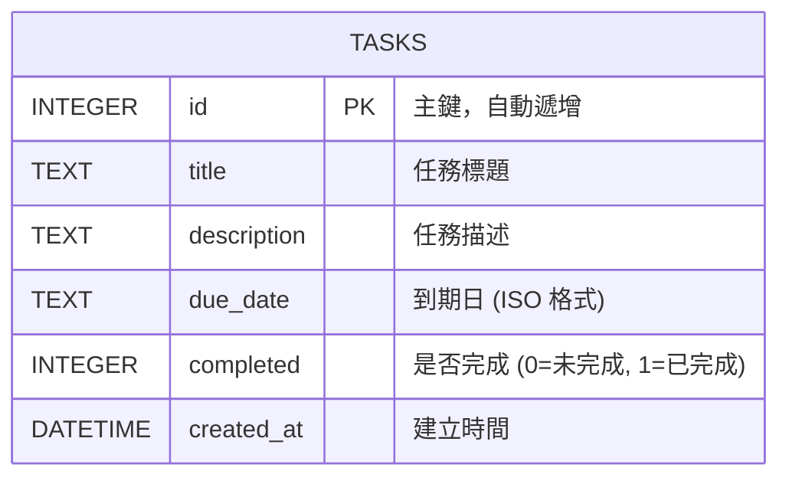

# 資料庫設計文件 (DB Design)

這份文件記錄了任務管理系統所使用的資料庫 Schema 設計，包含 ER 圖、資料表詳細說明，以及相關的實作細節。本系統採用 SQLite 作為資料庫。

## 1. ER 圖 (實體關係圖)

> **說明**：由於目前系統針對個人任務管理為主（MVP 範圍），並未實作多使用者或分類標籤等功能，因此資料庫架構非常單純，僅包含單一資料表 `tasks`，無其他外部關聯。

## 2. 資料表詳細說明

### `tasks` (任務表)

負責儲存使用者建立的所有待辦事項資料。

| 欄位名稱 | 資料型別 | 是否必填 | 預設值 | 說明 |
|---|---|---|---|---|
| `id` | INTEGER | 是 | 自動產生 | Primary Key，唯一識別碼 |
| `title` | TEXT | 是 | 無 | 任務的標題 |
| `description` | TEXT | 否 | NULL | 任務的詳細說明 |
| `due_date` | TEXT | 否 | NULL | 任務的到期日與時間 (建議格式為 `YYYY-MM-DD HH:MM`) |
| `completed` | INTEGER | 是 | `0` | 表示任務完成狀態，以 SQLite 慣用的 `0` (False) 或 `1` (True) 儲存 |
| `created_at` | DATETIME | 是 | `CURRENT_TIMESTAMP` | 紀錄資料建立的時間點 |

## 3. SQL 建表語法

建表語法請參考專案目錄下的 `database/schema.sql` 檔案。

## 4. Python Model 程式碼

資料庫互動邏輯已封裝於 `app/models/task_model.py` 中，使用 Python 內建的 `sqlite3` 模組，並提供完整的 CRUD（建立、讀取、更新、刪除）以及狀態切換方法。
