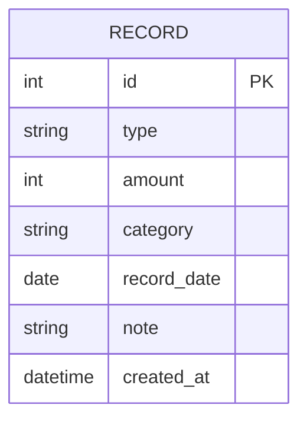

# DB Design 文件 — 個人記帳簿

## 1. 實體關係圖 (ER Diagram)

## 2. 資料表詳細說明

### `records` (收支紀錄)
統一儲存收入與支出的資料表。透過 `type` 欄位區分是收入 (income) 還是支出 (expense)，如此在首頁查詢近期紀錄及計算總額時會更方便。

| 欄位名稱 | 型別 | 必填 | 說明 |
| :--- | :--- | :--- | :--- |
| `id` | INTEGER | 是 | Primary Key, 自動遞增的唯一識別碼 |
| `type` | TEXT | 是 | 紀錄類型，值為 `'income'` 或 `'expense'` |
| `amount` | INTEGER | 是 | 金額 (整數型別) |
| `category` | TEXT | 是 | 類別名稱 (如：餐飲、交通、薪水等) |
| `record_date`| TEXT | 是 | 交易日期，以 `YYYY-MM-DD` 格式儲存 |
| `note` | TEXT | 否 | 備註說明 |
| `created_at` | DATETIME | 是 | 資料建立時間，預設為 `CURRENT_TIMESTAMP` |

## 3. SQL 建表語法
存放於 `database/schema.sql` 中。

## 4. Python Model 程式碼
因為沒有找到 `ARCHITECTURE.md` 指定使用 SQLAlchemy，這裡將預設使用內建的 `sqlite3` 實作。Model 程式碼存放於 `app/models/record.py` 中。
