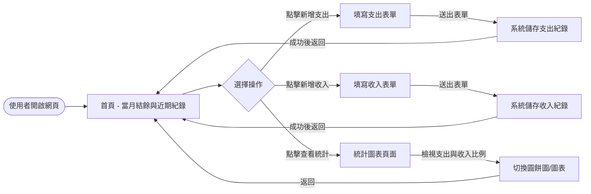
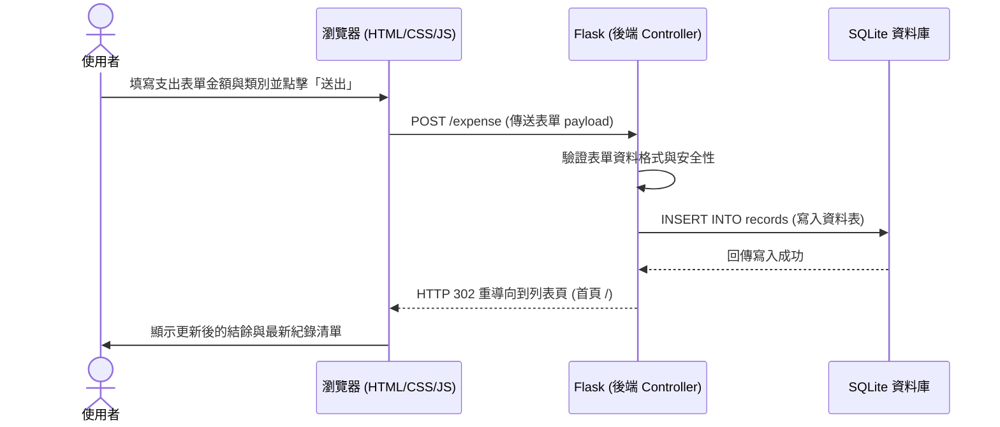

# 系統流程圖文件 (FLOWCHART)

## 1. 使用者流程圖（User Flow）

此流程圖描述使用者從開啟網站開始，能如何在「個人記帳簿」系統中操作各項功能。

## 2. 系統序列圖（Sequence Diagram）

此序列圖描述「使用者點擊新增紀錄（以新增支出為例）」到「資料成功寫入資料庫」的底層運作流程。

## 3. 功能清單對照表

以下整理了系統主要功能、預估的 URL 路徑與 HTTP 方法對照：

| 功能名稱 | URL 路徑 | HTTP 方法 | 說明 |
| :--- | :--- | :--- | :--- |
| 首頁 (儀表板) | `/` | GET | 顯示當月總收入、總支出、結餘與近期清單 |
| 新增支出頁面 | `/expense/new` | GET | 顯示新增支出的填答表單 |
| 送出新增支出 | `/expense` | POST | 接收支出表單資料並寫入資料庫 |
| 新增收入頁面 | `/income/new` | GET | 顯示新增收入的填答表單 |
| 送出新增收入 | `/income` | POST | 接收收入表單資料並寫入資料庫 |
| 統計圖表頁面 | `/statistics` | GET | 顯示每月支出的分類圓餅圖等數據分析 |
| 刪除指定項目 | `/record/<int:id>/delete` | POST | 在首頁或清單中刪除特定的收支紀錄 |

---
> **備註**：由於目前系統找不到 `docs/ARCHITECTURE.md` 文件，因此本流程圖是根據已有的 `docs/PRD.md` 中的功能需求及「使用 Flask + SQLite」的技術設定來產出的。這符合系統的預期規劃。
