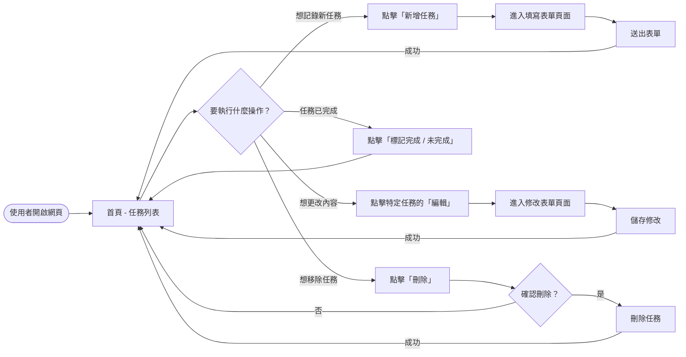
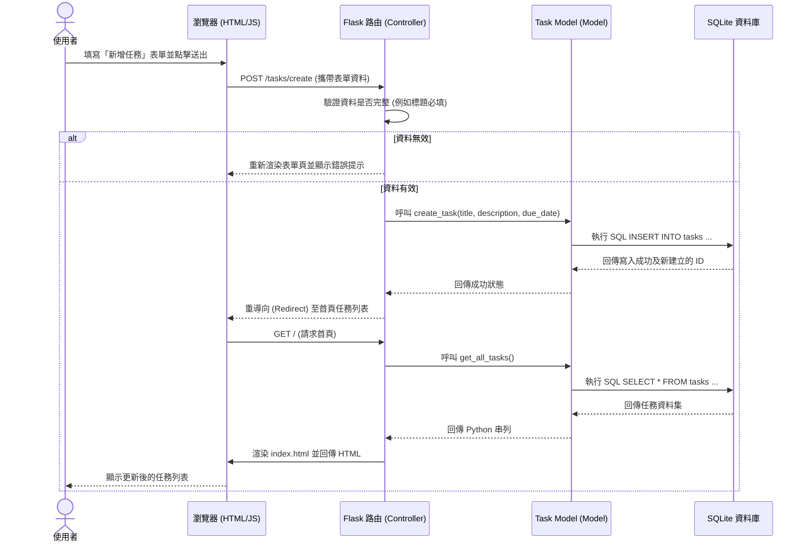

# 任務管理系統 - 流程圖文件 (Flowchart)

這份文件透過視覺化的流程圖展示使用者在系統中的操作路徑，以及在執行核心功能（例如新增任務）時，系統背後的元件如何互動與傳遞資料。

## 1. 使用者流程圖 (User Flow)

這個流程圖展示了使用者（學生）進入系統後可以進行的主要操作步驟。

## 2. 系統序列圖 (Sequence Diagram)

這個序列圖以「新增任務」為例，展示了從使用者填寫表單、送出到資料寫入資料庫的完整技術流程。

## 3. 功能清單對照表

以下為目前規劃的系統功能與其對應的 URL 路徑及 HTTP 方法：

| 功能名稱 | URL 路徑 | HTTP 方法 | 說明 |
|---|---|---|---|
| 檢視任務清單 (首頁) | `/` 或 `/tasks` | GET | 取得並顯示所有任務清單（依到期日排序），即將到期者高亮顯示 |
| 顯示新增表單頁面 | `/tasks/create` | GET | 顯示空白的新增任務表單讓使用者填寫 |
| 處理新增任務請求 | `/tasks/create` | POST | 接收表單傳來的資料並寫入資料庫 |
| 顯示編輯表單頁面 | `/tasks/<int:id>/edit` | GET | 根據任務 ID，查詢該任務資料並填入表單中顯示 |
| 處理編輯任務請求 | `/tasks/<int:id>/edit` | POST | 接收更新後的表單資料並覆寫資料庫原有紀錄 |
| 切換任務完成狀態 | `/tasks/<int:id>/toggle` | POST | 點擊時切換該任務的完成 (completed) 狀態 |
| 刪除任務 | `/tasks/<int:id>/delete` | POST | 根據任務 ID 刪除該筆特定任務 |
